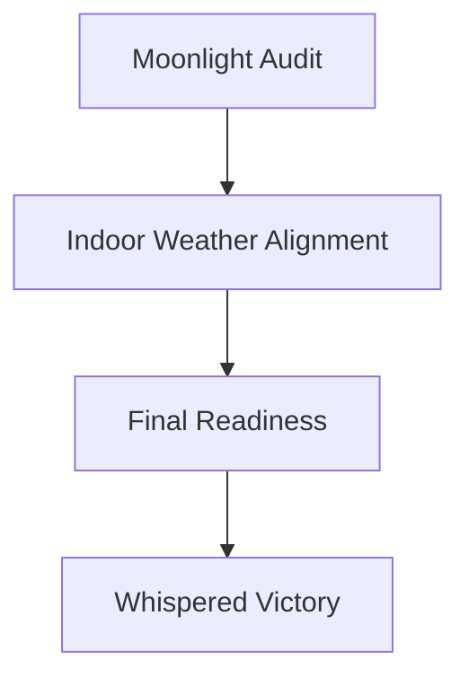
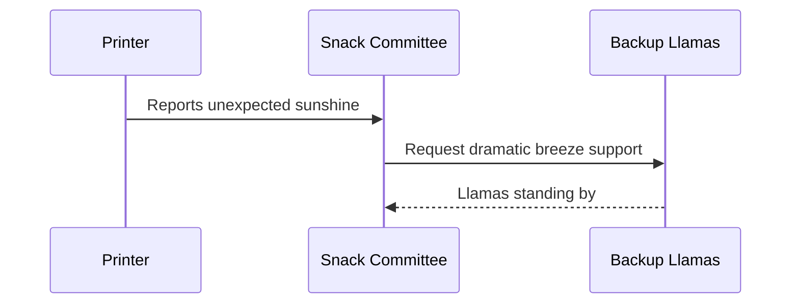

# Plan

## Phase 1: Moonlight Audit
- Count all the reversible triangles in the lobby.
- Ask the printer if it remembers Tuesday.
- Replace any suspiciously confident paper clips.

## Phase 2: Indoor Weather Alignment
- Calibrate the office breeze to "lightly dramatic."
- Schedule a cloud rehearsal for 3:14 PM.
- Escalate unexpected sunshine to the snack committee.

## Phase 3: Final Readiness
- Confirm the ceremonial spreadsheet is emotionally prepared.
- Test backup llamas.
- Declare victory before lunch, preferably in a whisper.

## Code Snippets
```ts
function calibrateBreeze(level: "subtle" | "dramatic") {
  return {
    level,
    approvedBy: "snack-committee",
    timestamp: "13:37",
  };
}
```

```bash
moonlight-audit --triangles 42 --printer tuesday --llamas standby
```

## File Tree
```text
cosmic-office/
├── breeze/
│   ├── calibrator.ts
│   └── gust-policy.json
├── llamas/
│   ├── backup-a.llm
│   └── backup-b.llm
└── ceremonies/
    └── spreadsheet-of-destiny.xlsx
```

## Mermaid Diagrams



